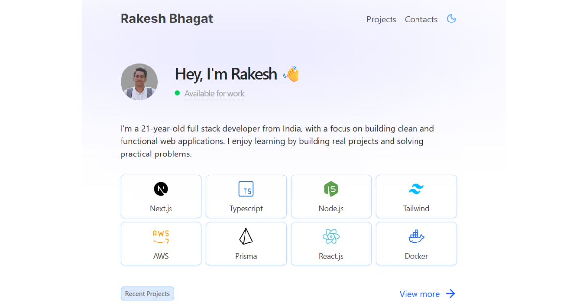

<div align="center">

# Rakesh Bhagat — Portfolio

**Full Stack Developer · Next.js · TypeScript · Node.js · PostgreSQL**

[](https://bhagat.dev)
[](https://nextjs.org)
[](https://react.dev)
[](https://www.typescriptlang.org)
[](https://tailwindcss.com)

[**View live site →**](https://bhagat.dev) · [Resume (PDF)](./public/Rakesh_Bhagat_updated_resume.pdf) · [GitHub](https://github.com/Rakesh-Bhagat)



</div>

---

## About

I'm a full stack developer who ships production software: multi-tenant CRMs with database-level access control, payment-integrated platforms, and real-time collaborative apps. This repository is the source of my personal site, built the same way I build client work: typed end to end, server-rendered, SEO-aware, and deployed through an automated pipeline.

## Highlights

- **Next.js 16 App Router + React 19** with server components and Turbopack in development.
- **Polished UI**: animated star field, custom cursor, motion-driven transitions, and a light/dark theme switcher (`next-themes`).
- **Content-driven**: projects, skills, experience, education, and nav are typed data modules in [`/data`](./data). Updating the site means editing data, not JSX.
- **SEO done properly**: per-page metadata, Open Graph and Twitter cards, canonical URLs, JSON-LD `Person` schema, generated `sitemap.xml` and `robots.txt`.
- **Working contact form**: a Next.js route handler sends mail through [Resend](https://resend.com), with error handling and proper status codes.
- **CI/CD**: every push to `main` triggers a GitHub Actions workflow that SSHes into a Hetzner VPS, pulls, installs with a frozen lockfile, builds, and reloads the app under PM2.

## Featured work

| Project | What it is | Stack |
| --- | --- | --- |
| **[Chate CRM](https://crm.chatecoachingclasses.co)** | Multi-branch CRM with WhatsApp automation. Ingests leads from 4 channels using HMAC-verified webhooks, idempotency keys and round-robin assignment. Config-driven pipeline engine; role-based access enforced by PostgreSQL Row-Level Security. | Next.js, TypeScript, PostgreSQL, Supabase |
| **[ProfitMaster](https://profitmaster.in)** | Education and events platform with paid courses, checkout flow and a custom admin dashboard for content, registrations and media. | Next.js, Prisma, Supabase, Cloudflare R2 |
| **[SketchyDraw](https://sketchydraw.bhagat.dev)** ([code](https://github.com/Rakesh-Bhagat/sketchyDraw)) | Real-time collaborative whiteboard with hand-drawn look, room-based sessions over WebSockets and Postgres persistence. | TypeScript, WebSocket, Node.js, RoughJS, Prisma |
| **[GGV Lost & Found](https://lost-found-drab.vercel.app/)** ([code](https://github.com/Rakesh-Bhagat/Lost-Found)) | Campus lost-and-found platform with auth and item posting. | Next.js, Postgres, Prisma |
| **[Plantify AI](https://plantify-hazel.vercel.app/)** ([code](https://github.com/Rakesh-Bhagat/Plantify)) | Upload a photo, get species and care instructions from Google Gemini. | React, Tailwind, Gemini API |

## Experience

**Full Stack Developer Intern — Crescentia One** *(Remote, Dec 2025 – Present)*

- Built e-commerce backends in Node.js/Express with payment-gateway and inventory APIs across 3 client platforms, **cutting API response time by 30%**.
- Diagnosed and fixed a production WhatsApp failure (every business-initiated send returned 500) caused by a missing button component for a template's dynamic URL.
- Traced slow navigation to a Vercel↔Supabase region mismatch; fixed it with streaming skeletons and cookie-only session reads across 9 routes.
- Migrated client sites from WordPress to Next.js + Express, **improving Core Web Vitals by 40%**.

## Education

B.Tech, Electronics & Communication Engineering — Guru Ghasidas Vishwavidyalaya (Central University), **CGPA 8.65 / 10** (2022 – 2026).

## Tech stack

| Area | Tools |
| --- | --- |
| Frontend | Next.js, React, TypeScript, Tailwind CSS, Motion |
| Backend | Node.js, Express, REST APIs, WebSockets, Webhooks |
| Data | PostgreSQL, Supabase (incl. RLS), Prisma |
| Infra | AWS, Docker, Cloudflare R2, Vercel, Hetzner VPS, PM2, GitHub Actions |
| Integrations | WhatsApp Business API, Resend, Google Gemini |

## Project structure

```
app/
  api/email/route.ts   Contact form endpoint (Resend)
  contact/             Contact page
  projects/            Projects page
  layout.tsx           Root layout, metadata, JSON-LD
  sitemap.ts           Generated sitemap
  robots.ts            Generated robots.txt
components/            Navbar, ProjectCard, StarField, CustomCursor, ThemeSwitcher, ...
data/                  Typed content: projects, skills, experience, education
public/                Images and resume
.github/workflows/     Deploy pipeline
```

## Run locally

Requires Node.js 20+ and [pnpm](https://pnpm.io).

```bash
git clone https://github.com/Rakesh-Bhagat/Portfolio.git
cd Portfolio
pnpm install
```

Create a `.env` file:

```env
RESEND_API_KEY=your_resend_api_key
EMAIL_USER=address_that_receives_messages@example.com
```

```bash
pnpm dev      # http://localhost:3000
pnpm build    # production build
pnpm start    # serve the production build
```

## Deployment

Pushing to `main` runs [`deploy.yml`](./.github/workflows/deploy.yml):

1. Authenticates to the server with an SSH key stored in GitHub Secrets.
2. `git pull`, then `pnpm install --frozen-lockfile` for reproducible builds.
3. `pnpm build`, then `pm2 restart` for a fast, low-downtime release.

## Contact

- Website: [bhagat.dev](https://bhagat.dev) (contact form)
- GitHub: [@Rakesh-Bhagat](https://github.com/Rakesh-Bhagat)

I'm open to full stack and backend roles. If something here caught your eye, get in touch.
